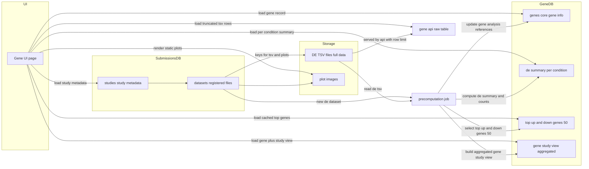
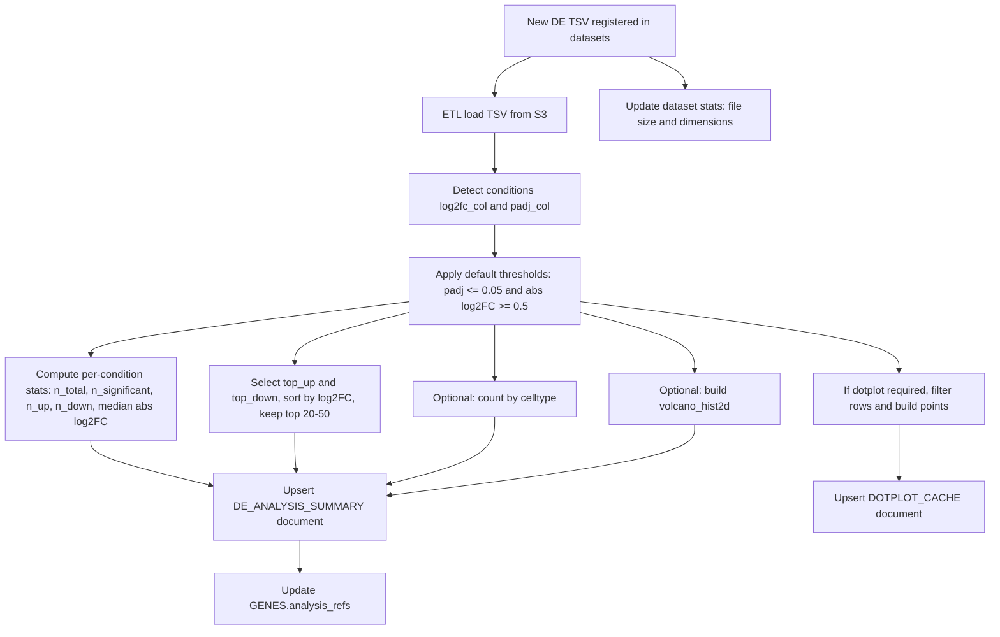

## 🚀 Quick start

1.  **Setup.**

    Use the Gatsby CLI ([install instructions](https://www.gatsbyjs.com/docs/tutorial/getting-started/part-0/#gatsby-cli))

1.  **Start developing.**

    Navigate into your new site’s directory and start it up.

    ```shell
    gatsby develop
    ```

1.  **Open the source code and start editing!**

    Your site is now running at `http://localhost:8000`!

    Note: You'll also see a second link: `http://localhost:8000/___graphql`. This is a tool you can use to experiment with querying your data. Learn more about using this tool in the [Gatsby Tutorial](https://www.gatsbyjs.com/docs/tutorial/getting-started/part-4/#use-graphiql-to-explore-the-data-layer-and-write-graphql-queries).

    Open the directory in your code editor of choice and edit `src/pages/index.js`. Save your changes and the browser will update in real time!
  
## 🧐 What's inside?

A quick look at the top-level files and directories you'll see in a typical Gatsby project.

    .
    ├── node_modules
    ├── src
    ├── .gitignore
    ├── gatsby-browser.js
    ├── gatsby-config.js
    ├── gatsby-node.js
    ├── gatsby-ssr.js
    ├── LICENSE
    ├── package.json
    └── README.md

1.  **`/node_modules`**: This directory contains all of the modules of code that your project depends on (npm packages) are automatically installed.

1.  **`/src`**: This directory will contain all of the code related to what you will see on the front-end of your site (what you see in the browser) such as your site header or a page template. `src` is a convention for “source code”.

1.  **`.gitignore`**: This file tells git which files it should not track / not maintain a version history for.

1.  **`gatsby-browser.js`**: This file is where Gatsby expects to find any usage of the [Gatsby browser APIs](https://www.gatsbyjs.com/docs/reference/config-files/gatsby-browser/) (if any). These allow customization/extension of default Gatsby settings affecting the browser.

1.  **`gatsby-config.js`**: This is the main configuration file for a Gatsby site. This is where you can specify information about your site (metadata) like the site title and description, which Gatsby plugins you’d like to include, etc. (Check out the [config docs](https://www.gatsbyjs.com/docs/reference/config-files/gatsby-config/) for more detail).

1.  **`gatsby-node.js`**: This file is where Gatsby expects to find any usage of the [Gatsby Node APIs](https://www.gatsbyjs.com/docs/reference/config-files/gatsby-node/) (if any). These allow customization/extension of default Gatsby settings affecting pieces of the site build process.

1.  **`gatsby-ssr.js`**: This file is where Gatsby expects to find any usage of the [Gatsby server-side rendering APIs](https://www.gatsbyjs.com/docs/reference/config-files/gatsby-ssr/) (if any). These allow customization of default Gatsby settings affecting server-side rendering.

1.  **`LICENSE`**: This Gatsby starter is licensed under the 0BSD license. This means that you can see this file as a placeholder and replace it with your own license.

1.  **`package.json`**: A manifest file for Node.js projects, which includes things like metadata (the project’s name, author, etc). This manifest is how npm knows which packages to install for your project.

1.  **`README.md`**: A text file containing useful reference information about your project.

## 🎓 Learning Gatsby

Looking for more guidance? Full documentation for Gatsby lives [on the website](https://www.gatsbyjs.com/). Here are some places to start:

- **For most developers, we recommend starting with our [in-depth tutorial for creating a site with Gatsby](https://www.gatsbyjs.com/docs/tutorial/getting-started/).** It starts with zero assumptions about your level of ability and walks through every step of the process.

- **To dive straight into code samples, head [to our documentation](https://www.gatsbyjs.com/docs/).** In particular, check out the _Guides_, _API Reference_, and _Advanced Tutorials_ sections in the sidebar.

## Deploying

Learn how to deploy here [Deploy and Host](https://www.gatsbyjs.com/docs/how-to/previews-deploys-hosting/).

### Current Static File Structure
Pages

```
┌ src/pages/404.js
│ ├   /404/
│ └   /404.html
├ src/pages/about.js
│ └   /about/
├ src/pages/index.js
│ └   /
├ src/pages/policies.js
│ └   /policies/
├ src/pages/gene.js
│ └   /gene/
└ src/pages/data.js
  └   /data/
```

# MorPhiC Gene & DE Data – DB Architecture & API

This document describes:

- How submissions DB and GeneDB are organised
- What we precompute offline
- How the public Gene API exposes this data to the UI

---

## High-Level Architecture


## Differential Expression Precomputation Pipeline

